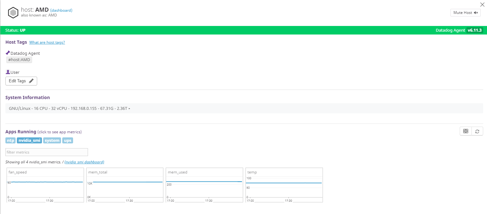
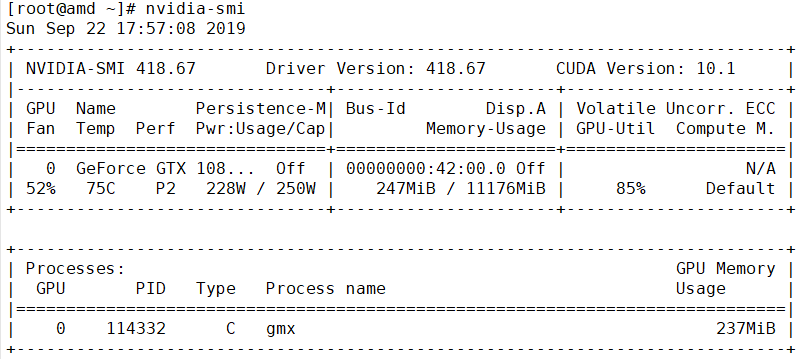

# datadogdog-nvidiasmi

將nvidiasmi的GPU溫度、記憶體使用量、風扇轉速回報到datadog上

## 原理

使用python套件[plumbum](https://plumbum.readthedocs.io/en/latest/)與linux shell互動，讀取數據並交給datadog-agent，再回傳

## 需求

此外掛透過[plumbum](https://plumbum.readthedocs.io/en/latest/)與linux shell互動，抓取溫度資料，所以需在datadog的python資料夾中安裝plumbum

```
/opt/datadog-agent/embedded/bin/pip install plumbum
```

## 安裝教學

* 複製下列兩個檔案到datadog-agent目錄中

  ```
  cp nvidiasmi.yaml /etc/datadog-agent/conf.d/
  cp nvidiasmi.py /etc/datadog-agent/checks.d/
  ```

* 更改兩個檔案的所有者為dd-agent

  ```
  chown -R dd-agent:dd-agent /etc/datadog-agent
  ```

* 重新啟動datadog-agent

  ```
  systemctl restart datadog-agent
  ```

* 測試

  ```
  datadog-agent check nvidiasmi
  ```

  出現ok字樣即安裝成功，稍待幾分鐘即可於datadog平台得到資料

## 演示



回報的資料與shell比較





fan_speed即為GPU Fan

mem_total即為GPU總記憶體

mem_used即為使用的GPU記憶體

temp即為目前GPU溫度


nvidiasmi也可以傳其他參數，請看[說明文件](https://nvidia.custhelp.com/app/answers/detail/a_id/3751/~/useful-nvidia-smi-queries)，這樣的做法可以把很多東西傳到datadog，我也有做傳cpu溫度資料的[datadog-sensors](https://github.com/allmwh/datadog-sensors)，ups資料也有，之後慢慢放~~

